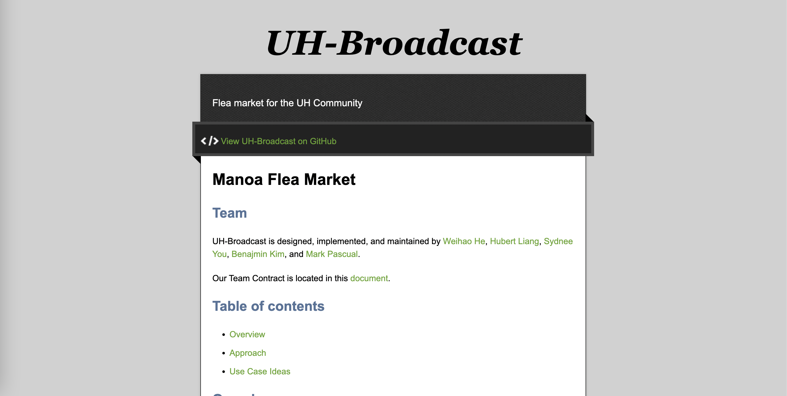
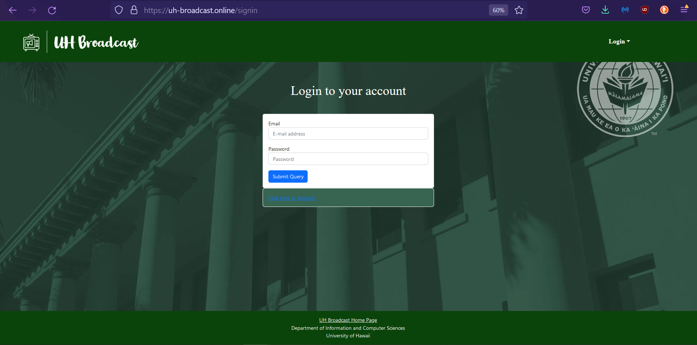
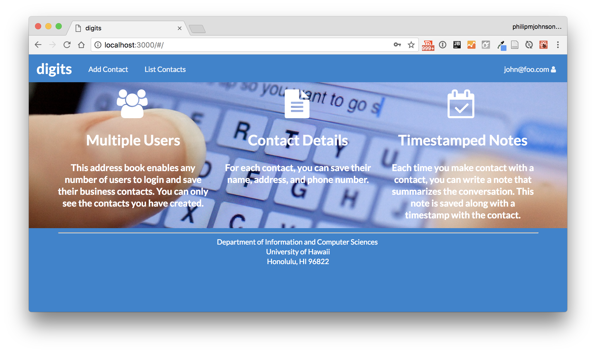
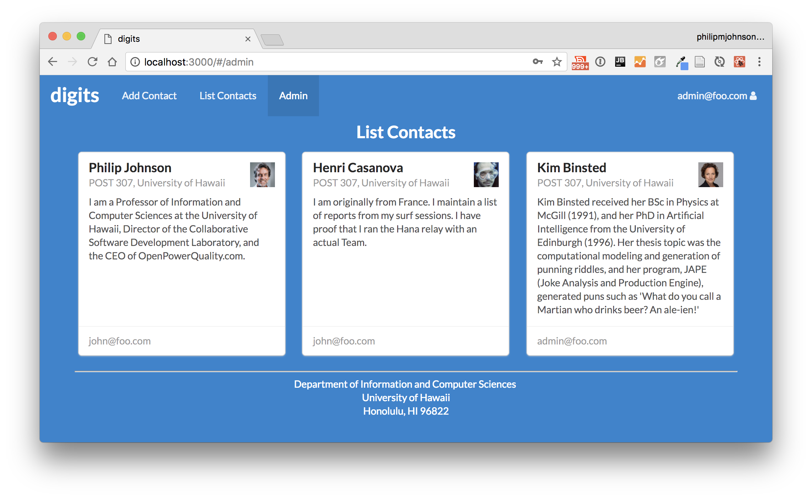
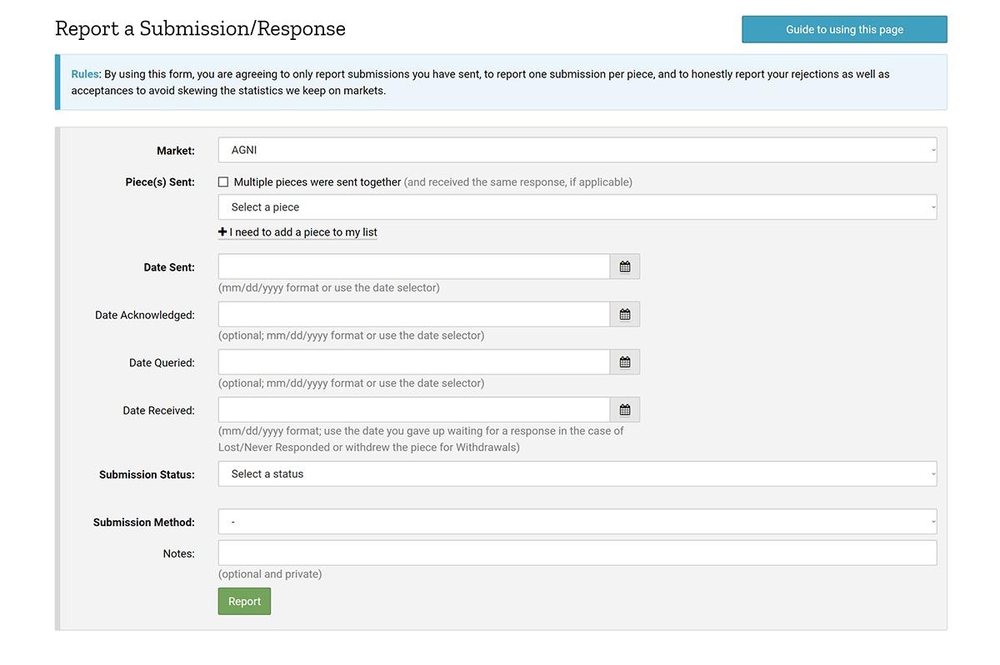
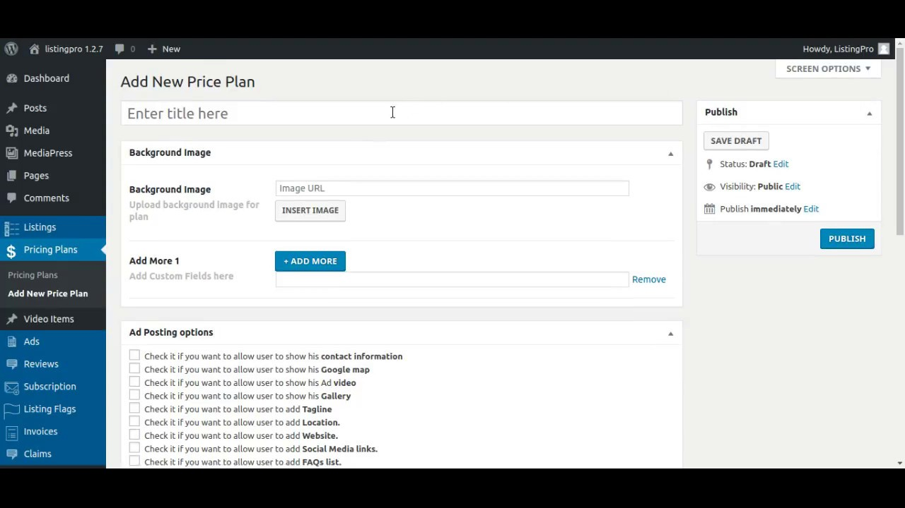
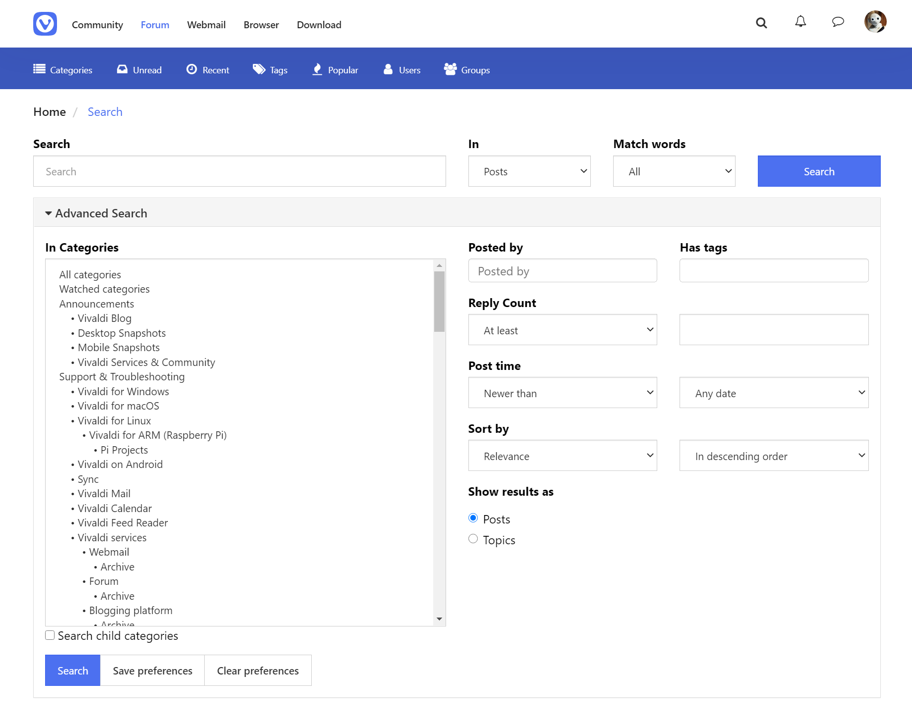
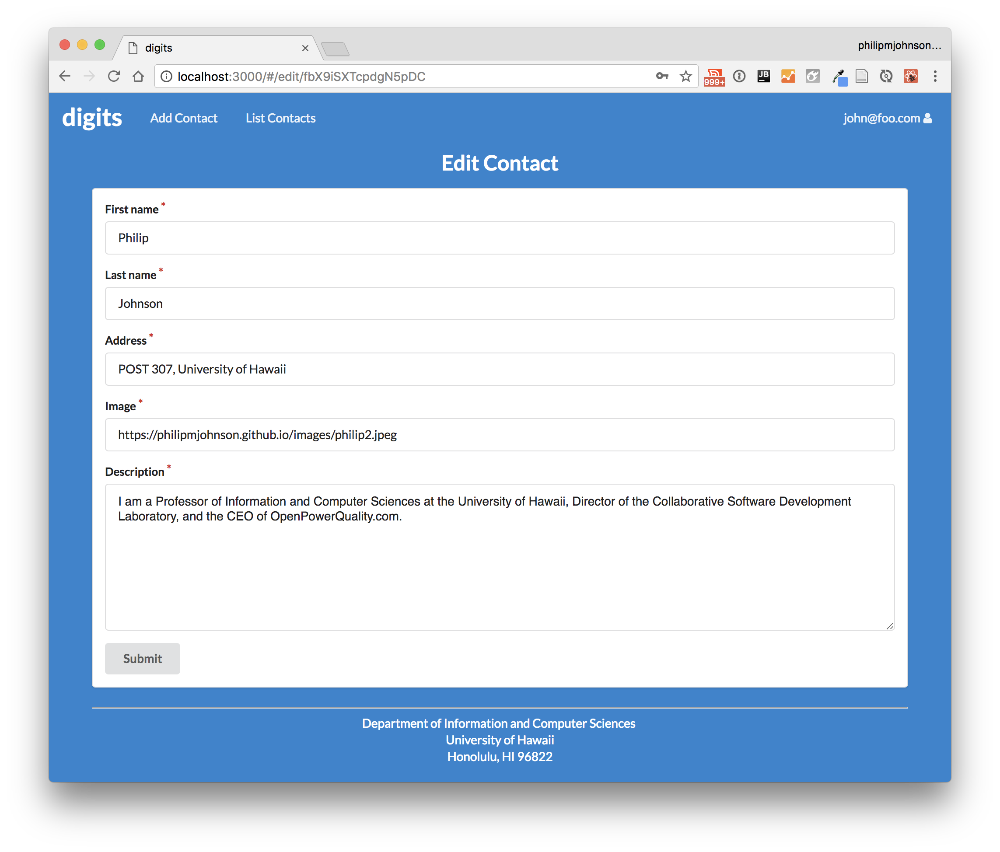

# Manoa Flea Market

## Team
UH-Broadcast is designed, implemented, and maintained by [Weihao He](https://weihaohe-cys.github.io/), [Hubert Liang](https://hooobot.github.io/), [Sydnee You](http://sydnee-you.github.io/), [Benajmin Kim](https://bkimcode.github.io/
), and [Mark Pascual](https://markgpascual.github.io/).

Our Team Contract is located in this [document](https://docs.google.com/document/d/1k1tqSxgTJwKHZWhcACvvfOT7k_4JKaP_G-6CVPcRs6s/edit?usp=sharing).

## Table of contents

<!-- * [Deployment](#deployment) -->
* [Overview](#overview)
* [Approach](#approach)
* [Use Case Ideas](#use-case-ideas)

## Overview

UH-Broadcast is an example web application that provides pages to view and post listings of various items for the UH community. The problem: UHM students have a “rapid” churn rate in goods and services. Students leave the dorm for an on-campus apartment and need to get rid of dorm-specific stuff and acquire apartment-specific stuff. Students graduate and need to get rid of stuff because they’re moving off-island. There is therefore a tremendous amount of “campus-specific” goods and services that could be more effectively recycled and reused if there was an effective marketplace for these specific kinds of items.

The solution: The Manoa Flea Market is an application for UHM students to facilitate buying and selling of student-related goods and services.

## Approach

This project is similar to Craigslist, except for the following:

Buyers and sellers must be UH students, faculty, or staff. (See “Beyond the Basics” for a way to enforce this.)
There is no anonymity: buyers and sellers connect through their UH credentials.
Transactions are expected to occur on-campus. If a seller wants to meet off-campus, that can be a red-flag.
Because buyers and sellers are from UHM, the goods and services will be relevant to UH students.
These factors make Manoa Flea Market an attractive alternative to Craigslist.

When designing your version of this application, keep the following in mind:

Roles: There are at least two roles in this system: users and administrators. Users are UH students who can buy or sell goods and services. Administrators are special users who have the ability to monitor the behavior of users in the system, and create new categories and other functionality.

Categories: Similar to Craigslist, there are broad categories for goods and services. One obvious pair of categories is “Textbooks to sell” and “Textbooks wanted”. There are no “hookup” categories (i.e. Men seeking Women, etc.). You will need to do some research to figure out the appropriate set of categories.

Notifications: By default, communication occurs via UH email, but students can also elect to receive information via text message. To do this, they must specify both their mobile phone number as well as their provider (i.e. Verizon, AT&T). Most providers have an “SMS gateway” mechanism that will enable your app to generate a text message to them. (Another alternative is Twilio, but that costs money).

Alerts: Users can set up alerts, for example if they are looking for a sofa, or a particular textbook, or whatever. Then they are automatically notified when that item is listed for sale.

Photos: The system must support photos. Initially, images can be specified as URLs, but the final version should support uploading of photos.

Complaints: Users can mark content or other users as inappropriate. The admins must resolve these issues and ban users who violate the Terms of Use.

Note: if you choose this idea for your final project, you cannot name it “Manoa Flea Market”. Come up with a different name for your final project.

Some possible mockup pages include:

## User Guide

This section provides a walkthrough of the UH-Broadcast user interface and its capabilities.

#### Landing Page

#### Login Page

- Allows students and members of UH System to sign in using their UH accounts.
- User accounts have limited access, admin accounts have access to restricting accounts and removing inappropriate posts/listings.

#### User Home Page / Admin Home Page

- The home page for User and Admin would be relatively similar with the only difference being the administrative features being visible for designated Admin accounts.

- Users can view recent listings and sort using nav-bar dropdown to specify category

#### Report Abuse Page

- Allows users to submit reports to admins about specific posts or users that may be rulebreaking.

#### Add Listings Page

- Allows users to add products/services to be sold/offered. Should also allow users to upload pictures conveniently.

#### Search Page with Categories

- Allows users to categorically search and organize listings based on selected constraints.

#### Edit Listings Page

- Allows users to edit their existing posts when necessary.

## Use Case Ideas
Whether or not the following bullet points list all pages or not, the completed use case should show an end-to-end scenario of using the system.

* New user goes to landing page, logs in, gets home page, sets up profile. (How do they learn how system works?)
* Admin goes to landing page, logs in, gets home page, edits site.
* User goes to landing page, logs in, looks for item, sets up notification.
* User logs in, lists item to sell.
* User tries to buy item.
* User and admin interact to ban inappropriate usage.

## Beyond the Basics
After implementing the basic functionality, here are ideas for more advanced features:

* A rating system for buyers and sellers.
* Map-based interface to indicate where goods are.
