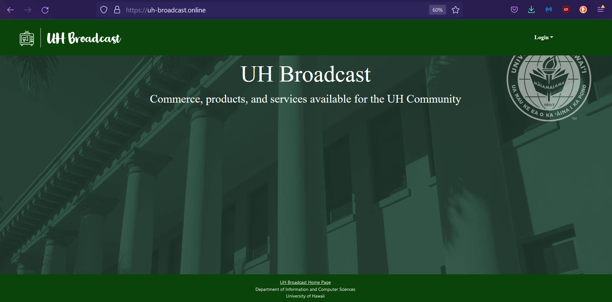
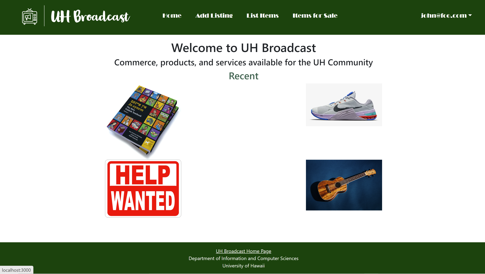
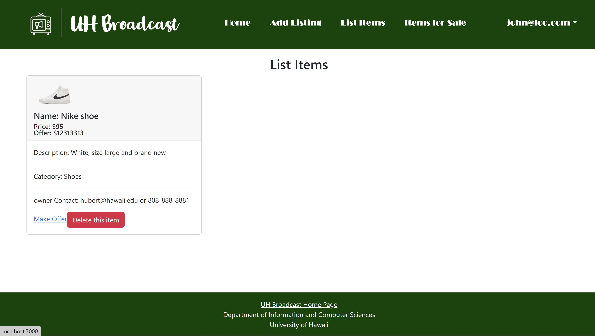
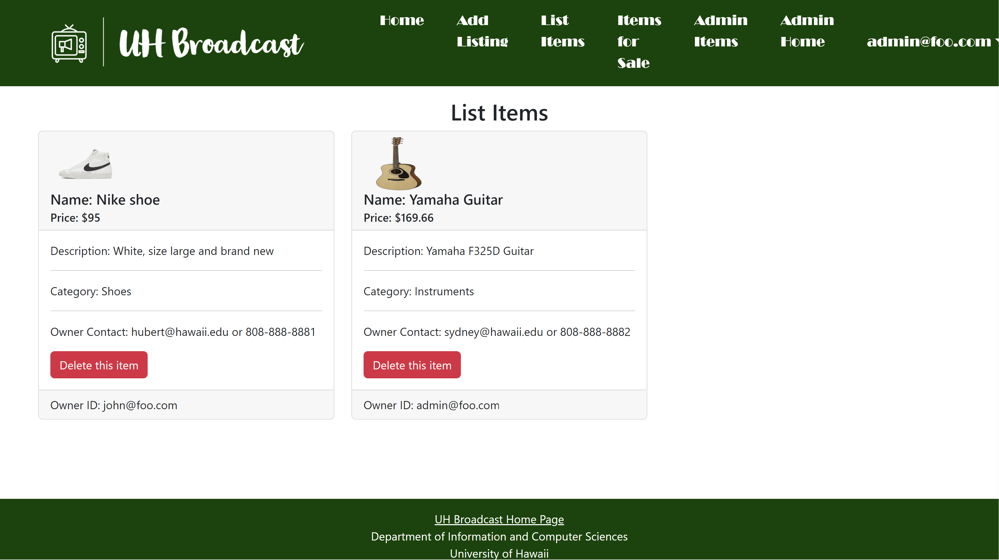
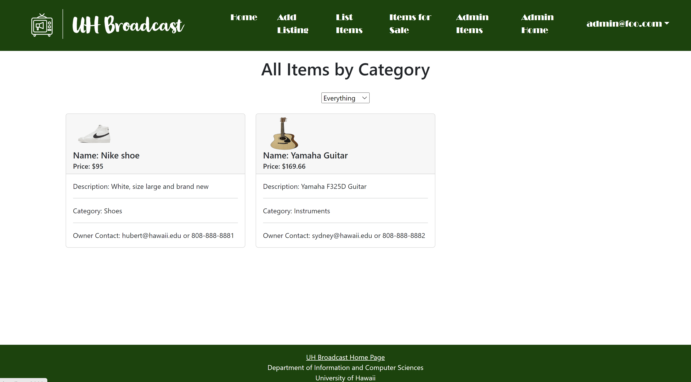
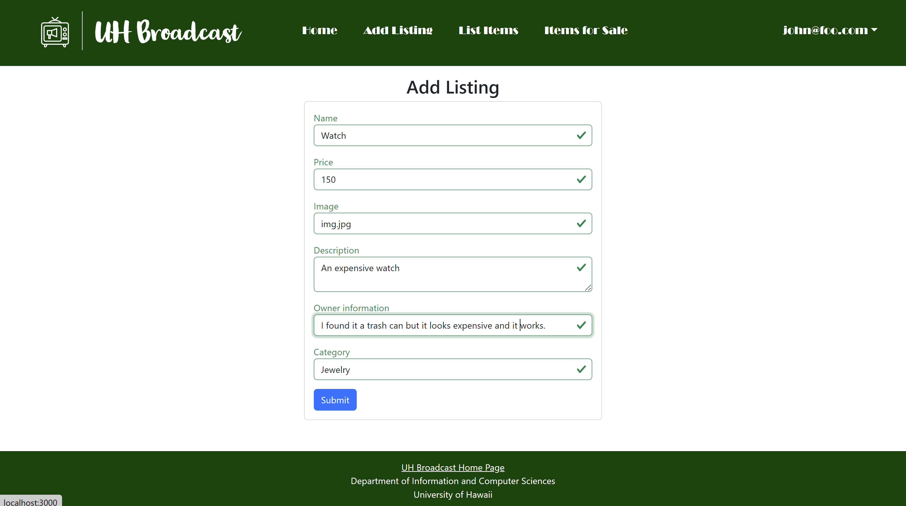
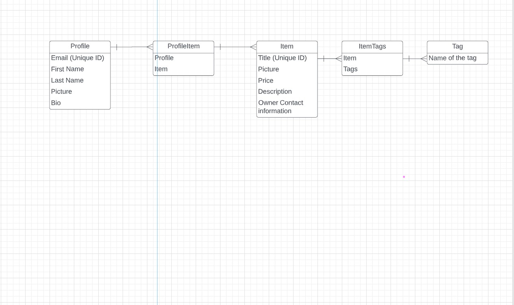

# Manoa Flea Market

## Team
UH-Broadcast is designed, implemented, and maintained by [Weihao He](https://weihaohe-cys.github.io/), [Hubert Liang](https://hooobot.github.io/), [Sydnee You](http://sydnee-you.github.io/), [Benajmin Kim](https://bkimcode.github.io/
), and [Mark Pascual](https://markgpascual.github.io/).

Our Team Contract is located in this [document](https://docs.google.com/document/d/1k1tqSxgTJwKHZWhcACvvfOT7k_4JKaP_G-6CVPcRs6s/edit?usp=sharing).

## Table of contents

<!-- * [Deployment](#deployment) -->
* [Overview](#overview)
* [Approach](#approach)
* [Walkthrough](#userguide)
* [Community Feedback](#community-feedback)
* [Developer Guide](#developer-guide)
* [Deployment](#deployment)
* [Project Milestones](#project-milestones)
* [Beyond The Basics](#beyond-the-basics)


## Overview

UH-Broadcast is an example web application that provides pages to view and post listings of various items for the UH community. The problem: UHM students have a “rapid” churn rate in goods and services. Students leave the dorm for an on-campus apartment and need to get rid of dorm-specific stuff and acquire apartment-specific stuff. Students graduate and need to get rid of stuff because they’re moving off-island. There is therefore a tremendous amount of “campus-specific” goods and services that could be more effectively recycled and reused if there was an effective marketplace for these specific kinds of items.

The solution: The Manoa Flea Market is an application for UHM students to facilitate buying and selling of student-related goods and services.


## Approach

This project is similar to Craigslist, except for the following:

Buyers and sellers must be UH students, faculty, or staff. (See “Beyond the Basics” for a way to enforce this.)
There is no anonymity: buyers and sellers connect through their UH credentials.
Transactions are expected to occur on-campus. If a seller wants to meet off-campus, that can be a red-flag.
Because buyers and sellers are from UHM, the goods and services will be relevant to UH students.
These factors make Manoa Flea Market an attractive alternative to Craigslist.

When designing your version of this application, keep the following in mind:

Roles: There are at least two roles in this system: users and administrators. Users are UH students who can buy or sell goods and services. Administrators are special users who have the ability to monitor the behavior of users in the system, and create new categories and other functionality.

Categories: Similar to Craigslist, there are broad categories for goods and services. One obvious pair of categories is “Textbooks to sell” and “Textbooks wanted”. There are no “hookup” categories (i.e. Men seeking Women, etc.). You will need to do some research to figure out the appropriate set of categories.

Notifications: By default, communication occurs via UH email, but students can also elect to receive information via text message. To do this, they must specify both their mobile phone number as well as their provider (i.e. Verizon, AT&T). Most providers have an “SMS gateway” mechanism that will enable your app to generate a text message to them. (Another alternative is Twilio, but that costs money).

Alerts: Users can set up alerts, for example if they are looking for a sofa, or a particular textbook, or whatever. Then they are automatically notified when that item is listed for sale.

Photos: The system must support photos. Initially, images can be specified as URLs, but the final version should support uploading of photos.

Complaints: Users can mark content or other users as inappropriate. The admins must resolve these issues and ban users who violate the Terms of Use.

Note: if you choose this idea for your final project, you cannot name it “Manoa Flea Market”. Come up with a different name for your final project.

Some possible mockup pages include:

## User Guide

This section provides a walkthrough of the UH-Broadcast user interface and its capabilities.

#### Landing Page




#### Login Page


- Allows students and members of UH System to sign in using their UH accounts.
- User accounts have limited access, admin accounts have access to restricting accounts and removing inappropriate posts/listings.

#### User Home Page / Admin Home Page




- The home page for User and Admin would be relatively similar with the only difference being the administrative features being visible for designated Admin accounts.

- Users can view recent listings and sort using nav-bar dropdown to specify category

<!-- #### Report Abuse Page


- Allows users to submit reports to admins about specific posts or users that may be rulebreaking. -->

#### User/Admin List Item Page



- List Item page will retrieve all the items in the database.
- User will only ouput the items they added.
- Admin will be able to retrieve all items from all accounts.
- Click on delete to remove the item from the database.

#### All Items by Category Page


- This allows both users and admin alike to view all the items for sale.
- It is like the Admin List Item Page except users cannot delete the items. 


#### Add Listings Page



- Allows users to add products/services to be sold/offered. Should also allow users to upload pictures conveniently.

<!-- #### Search Page with Categories


- Allows users to categorically search and organize listings based on selected constraints. -->

<!-- #### Edit Listings Page


- Allows users to edit their existing posts when necessary. -->

## Community Feedback

This section comprises of feedback about our application from fellow UH students who are not currently in our software engineering class.

### Rena
Rena, Sydnee's former classmate from a semester ago, reviewed the website and suggested being able to add multiple images for one item as sellers usually use multiple images to show the item at different angles.  She commented that our website looks cute and is easy to use even for beginners who are not used to navigating websites. She thinks also commented that it looks professional.


## Developer Guide

This section provides information of interest to Meteor developers wishing to use this code base as a basis for their own development tasks.

### Installation

First, [install Meteor](https://www.meteor.com/install).

Second, visit the [UH Broadcast application github page](https://github.com/UH-Broadcast/BroadcastHosting), and click the "Clone" button to clone your own repository initialized with a copy of this application. Alternatively, you can download the sources as a zip file or make a fork of the repo.  However you do it, download a copy of the repo to your local computer.

Third, cd into the BroadcastHosting/app directory and install libraries with:

```
$ meteor npm install
```

Fourth, run the system with:

```
$ meteor npm run start
```

If all goes well, the application will appear at [http://localhost:3000](http://localhost:3000).

### Application Design

UH Broadcast is based upon [meteor-application-template-react](https://ics-software-engineering.github.io/meteor-application-template-react/) and [meteor-example-form-react](https://ics-software-engineering.github.io/meteor-example-form-react/). Please use the videos and documentation at those sites to better acquaint yourself with the basic application design and form processing in UH Broadcast.

### Data model

As noted above, the UH Broadcast data model consists of three "primary" collections (Projects, Profiles, and Interests), as well as three "join" Collections (ProfilesProjects, ProfilesInterests, and ProjectsInterests).  To understand this design choice, consider the situation where you want to specify the projects associated with a Profile.

Design choice #1: Provide a field in Profile collection called "Projects", and fill it with an array of project names. This choice works great when you want to display a Profile and indicate the Projects it's associated with.  But what if you want to go the other direction: display a Project and all of the Profiles associated with it?  Then you have to do a sequential search through all of the Profiles, then do a sequential search through that array field looking for a match.  That's computationally expensive and also just silly.

Design choice #2:  Provide a "join" collection where each document contains two fields: Profile name and Project name. Each entry indicates that there is a relationship between those two entities. Now, to find all the Projects associated with a Profile, just search this collection for all the documents that match the Profile, then extract the Project field. Going the other way is just as easy: to find all the Profiles associated with a Project, just search the collection for all documents matching the Project, then extract the Profile field.

UH Broadcast implements Design choice #2 to provide pair-wise relations between all three of its primary collections:



The fields in boldface (Email for Profiles, and Name for Projects and Interests) indicate that those fields must have unique values so that they can be used as a primary key for that collection. This constraint is enforced in the schema definition associated with that collection.


## Initialization

The [config](https://github.com/uh-broadcast/broadcasthosting/tree/main/config) directory is intended to hold settings files.  The repository contains one file: [config/settings.development.json](https://github.com/UH-Broadcast/BroadcastHosting/blob/main/config/settings.development.json).

This file contains default definitions for Profiles, Projects, and Interests and the relationships between them. Consult the walkthrough video for more details.

The settings.development.json file contains a field called "loadAssetsFile". It is set to false, but if you change it to true, then the data in the file app/private/data.json will also be loaded.  The code to do this illustrates how to initialize a system when the initial data exceeds the size limitations for the settings file.


### Quality Assurance

#### ESLint

UH Broadcast includes a [.eslintrc](https://github.com/UH-Broadcast/BroadcastHosting/blob/main/app/.eslintrc.js) file to define the coding style adhered to in this application. You can invoke ESLint from the command line as follows:

```
meteor npm run lint
```

Here is sample output indicating that no ESLint errors were detected:

```
$ meteor npm run lint

> UH-Broadcast@ lint C:\Users\HRLia\Documents\GitHub\BroadcastHosting\app
> eslint --quiet --ext .jsx --ext .js ./imports && eslint --quiet --ext .js ./tests

$
```

ESLint should run without generating any errors.

It's significantly easier to do development with ESLint integrated directly into your IDE (such as IntelliJ).

#### End to End Testing

UH Broadcast uses [TestCafe](https://devexpress.github.io/testcafe/) to provide automated end-to-end testing.

The UH Broadcast end-to-end test code employs the page object model design pattern.  In the [broadcasthosting tests/ directory](https://github.com/uh-broadcast/broadcasthosting/tree/main/app/tests), the file [tests.testcafe.js](https://github.com/UH-Broadcast/BroadcastHosting/blob/main/app/tests/tests.testcafe.js) contains the TestCafe test definitions. The remaining files in the directory contain "page object models" for the various pages in the system (i.e. Home, Landing, Interests, etc.) as well as one component (navbar). This organization makes the test code shorter, easier to understand, and easier to debug.

To run the end-to-end tests in development mode, you must first start up a BroadcastHosting instance by invoking `meteor npm run start` in one console window.

Then, in another console window, start up the end-to-end tests with:

```
meteor npm run testcafe
```

You will see browser windows appear and disappear as the tests run.  If the tests finish successfully, you should see the following in your second console window:

```
$ meteor npm run testcafe

> UH-Broadcast@ testcafe C:\Users\HRLia\Documents\GitHub\BroadcastHosting\app
> testcafe chrome tests/*.testcafe.js      

 Running tests in:
 - Chrome 107.0.0.0 / Windows 10   

 UH-Broadcast localhost test with default db
 √ Test that landing page shows up
 √ Test that SignIn and SignOut work
 √ Test the List Item page
 √ Test the Add Listing page
 √ Test the Make Offer page
 √ Test the Categories page


 6 passed (1m 44s)


 $
```

You can also run the testcafe tests in "continuous integration mode".  This mode is appropriate when you want to run the tests using a continuous integration service like Jenkins, Semaphore, CircleCI, etc.  In this case, it is problematic to already have the server running in a separate console, and you cannot have the browser window appear and disappear.

To run the testcafe tests in continuous integration mode, first ensure that UH Broadcast is not running in any console.

Then, invoke `meteor npm run testcafe-ci`.  You will not see any windows appear.  When the tests finish, the console should look like this:

```
$ meteor npm run testcafe-ci

> UH-Broadcast@ testcafe-ci C:\Users\HRLia\Documents\GitHub\BroadcastHosting\app
> testcafe chrome:headless tests/*.testcafe.js -q --app "meteor npm run start"

 Running tests in:
 - Chrome 107.0.5304.122 / Windows 10       
                                            
 UH Broadcast localhost test with default db
 ✓ Test that landing page shows up (unstable)
 √ Test that SignIn and SignOut work
 √ Test the List Item page
 √ Test the Add Listing page
 √ Test the Make Offer page
 √ Test the Categories page


 6 passed (2m 14s)

$
```

All the tests pass, but the first test is marked as "unstable". At the time of writing, TestCafe fails the first time it tries to run a test in this mode, but subsequent attempts run normally. To prevent the test run from failing due to this problem with TestCafe, we enable [testcafe quarantine mode](https://devexpress.github.io/testcafe/documentation/guides/basic-guides/run-tests.html#quarantine-mode).

The only impact of quarantine mode should be that the first test is marked as "unstable".

## From mockup to production

UH Broadcast is meant to illustrate the use of Meteor for developing an initial proof-of-concept prototype.  For a production application, several additional security-related changes must be implemented:

* Use of email-based password specification for users, and/or use of an alternative authentication mechanism.
* Use of https so that passwords are sent in encrypted format.
* Removal of the insecure package, and the addition of Meteor Methods to replace client-side DB updates.

(Note that these changes do not need to be implemented for ICS 314, although they are relatively straightforward to accomplish.)

## Continuous Integration

Badge from Integration:
<br>
<br>
[](https://github.com/UH-Broadcast/BroadcastHosting/actions/workflows/ci.yml)

UH Broadcast uses [GitHub Actions](https://docs.github.com/en/free-pro-team@latest/actions) to automatically run ESLint and TestCafe each time a commit is made to the default branch.  You can see the results of all recent "workflows" at [https://github.com/UH-Broadcast/BroadcastHosting/actions](https://github.com/UH-Broadcast/BroadcastHosting/actions).

The workflow definition file is quite simple and is located at
[.github/workflows/ci.yml](https://github.com/UH-Broadcast/BroadcastHosting/actions/workflows/ci.yml).


## Deployment 
[Digital Ocean Deployment](http://uh-broadcast.online/)

## Project Milestones
[Milestone 1](https://github.com/orgs/UH-Broadcast/projects/1/views/1)
<br>
[Milestone 2](https://github.com/orgs/UH-Broadcast/projects/2/views/1)
<br>
[Milestone 3](https://github.com/orgs/UH-Broadcast/projects/3)

## Use Case Ideas
Whether or not the following bullet points list all pages or not, the completed use case should show an end-to-end scenario of using the system.

* New user goes to landing page, logs in, gets home page, sets up profile. (How do they learn how system works?)
* Admin goes to landing page, logs in, gets home page, edits site.
* User goes to landing page, logs in, looks for item, sets up notification.
* User logs in, lists item to sell.
* User tries to buy item.
* User and admin interact to ban inappropriate usage.

## Beyond the Basics
After implementing the basic functionality, here are ideas for more advanced features:

* A rating system for buyers and sellers.
* Map-based interface to indicate where goods are.
