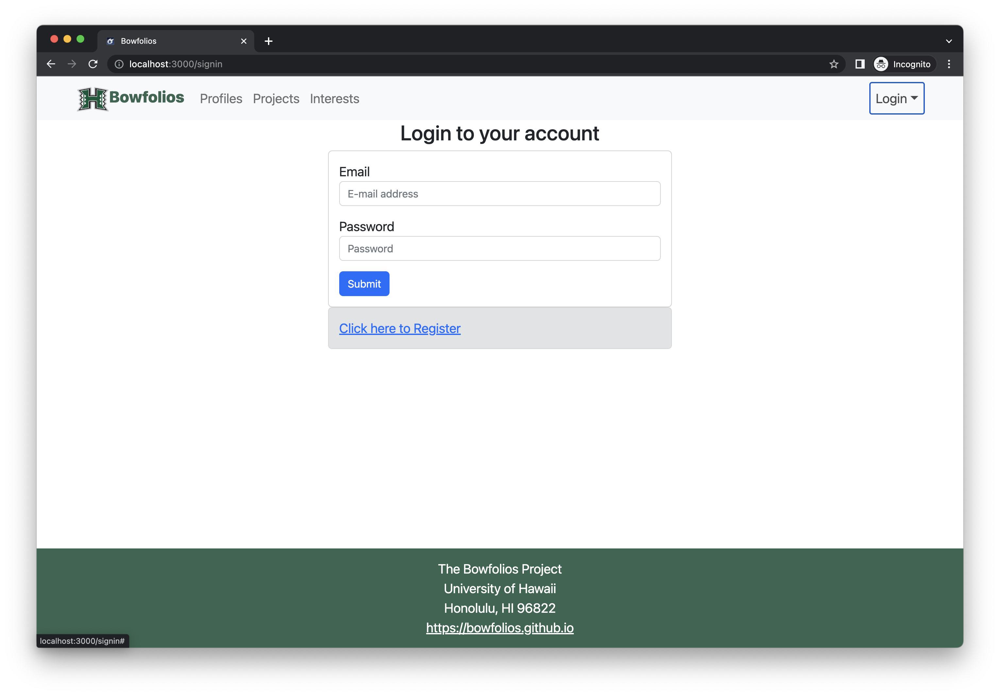

# Manoa Flea Market

## Table of contents

* [Overview](#overview)
<!-- * [Deployment](#deployment) -->
* [User Guide](#user-guide)
* [Community Feedback](#community-feedback)
* [Developer Guide](#developer-guide)
* [Development History](#development-history)
* [Continuous Integration](#continuous-integration)
* [Walkthrough videos](#walkthrough-videos)
* [Example enhancements](#example-enhancements) 
* [Team](#team)

## Overview

UH-Broadcast is an example web application that provides pages to view and post listings of various items for the UH community. It illustrates various technologies useful to ICS software engineering students, including:

* [Meteor](https://www.meteor.com/) for Javascript-based implementation of client and server code.
* [React](https://reactjs.org/) for component-based UI implementation and routing.
* [React Bootstrap](https://react-bootstrap.github.io/) CSS Framework for UI design.
* [Uniforms](https://uniforms.tools/) for React and Semantic UI-based form design and display.

<!-- It also provides code that implements a variety of useful design concepts, including:

* Three primary collections (Profiles, Projects, Interests) as well as three "join" Collections (ProfilesInterests, ProfilesProjects, and ProjectsInterests) that implement many-to-many relationships between them.
* Top-level index pages (Profiles, Interests, and Projects) that show how to manipulate these six collections in various ways.
* Initialization code to define default Profiles, Interests, and Projects and relations between them.
* A simple Filter page to illustrate how to perform simple queries on the database and display the results.
* Use of Meteor Methods to illustrate how to simplify implementation of multiple collection updates.
* Use of indexes to enforce uniqueness of certain fields in the collections, enabling them to serve as primary keys.
* Authentication using the built-in Meteor accounts package along with Sign Up and Sign In pages.
* Authorization examples: certain pages are public (Profiles, Projects, Interests), while other pages require login (AddProject, Filter).
* Use of Meteor Assets to initialize the database (helpful when initialization exceeds settings file size limits).
 -->
## User Guide

This section provides a walkthrough of the UH-Broadcast user interface and its capabilities.

#### Landing Page

#### Login Page

- Allows students and members of UH System to sign in using their UH accounts. 
- User accounts have limited access, admin accounts have access to restricting accounts and removing inappropriate posts/listings.

#### User Home Page / Admin Home Page

- The home page for User and Admin would be relatively similar with the only difference being the administrative features being visible for designated Admin accounts.

- Users can view recent listings and sort using nav-bar dropdown to specify category

#### Report Abuse Page

- Allows users to submit reports to admins about specific posts or users that may be rulebreaking. 

#### Add Listings Page

- Allows users to add products/services to be sold/offered. Should also allow users to upload pictures conveniently. 

#### Search Page with Categories

- Allows users to categorically search and organize listings based on selected constraints.

#### Edit Listings Page

- Allows users to edit their existing posts when necessary.

## Team
UH-Broadcast is designed, implemented, and maintained by [Weihao He](https://weihaohe-cys.github.io/), [Hubert Liang](https://hooobot.github.io/), [Sydnee You](http://sydnee-you.github.io/), [Benajmin Kim](https://bkimcode.github.io/
), and [Mark Pascual](https://markgpascual.github.io/).

